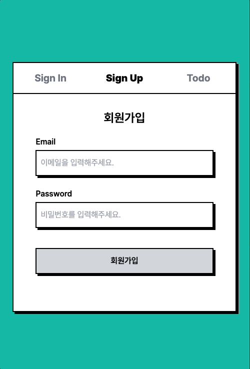
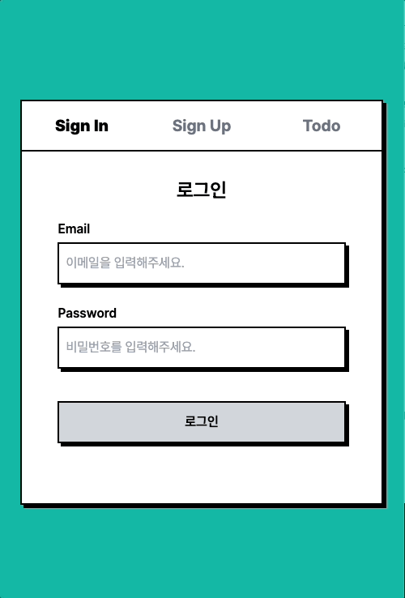
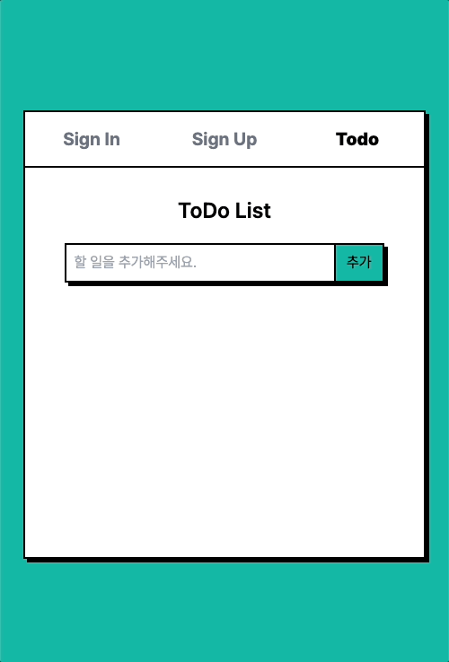

# 🏖 2023년 8월 원티드 프리온보딩 인턴십 프론트엔드

8월 원티드 프리온보딩 인턴십 프론트엔드 과제 제출용 레포지토리입니다.

## 프로젝트 소개

- 주제 : 로그인/회원가입/데이터 통신을 통한 투두 업데이트 기능을 포함한 투두리스트 웹 어플리케이션
- 과제 조건 레포 : [원티드 프리온보딩 프론트엔드 - 선발 과제](https://github.com/walking-sunset/selection-task)
- 작업 기간 : 2023.08.29 ~2023.09.01
- 팀 작업 레포지토리 : [[Week 1] Best Practice of Wanted Pre-onboarding Assignment](https://github.com/pre-onboarding-12th-team3/pre-onboarding-12th-1-3)

## 이름

채하은

## 사용 기술 스택

    

## 프로젝트 실행 방법

설치

```bash
npm install
```

실행

```bash
npm start
```

## 테스트 계정

- 아이디 : chae@test.com
- 비밀번호 : 12345678

## 배포 주소

https://wanted-pre-onboarding-frontend-eight-alpha.vercel.app/

## 구현 기능

### 1. 회원가입

| 회원가입                   | 가입실패                        |
| -------------------------- | ------------------------------- |
|  |  |

- 이메일과 비밀번호의 유효성 검사기능을 구현하고, 유효성 검사에 실패할 경우 에러 메시지를 출력합니다.
- 잦은 유효성 검사 요청을 방지하기 위해 디바운스를 적용했습니다.
- 이메일과 비밀번호 모두 유효성 검사를 통과할 경우 버튼을 활성화합니다.
- 회원가입을 성공하면 로그인 페이지로 이동합니다.
- 회원가입이 실패할 경우 에러 메시지를 모달로 출력합니다.

### 2. 로그인

| 로그인                     |
| -------------------------- |
|  |

| 정보 틀림                        | 없는 회원                        |
| -------------------------------- | -------------------------------- |
|  |  |

- 회원가입과 공통된 컴포넌트를 사용했습니다.
- 로그인을 성공하면 액세스 토큰을 localstorage에 저장한 후 투두 페이지로 이동합니다.
- 로그인에 실패할 경우 해당 되는 에러 메시지를 모달로 출력합니다.

### 3. 투두 리스트

| 투두리스트               |
| ------------------------ |
|  |

- 로그인을 성공하게 되면 해당 사용자의 정보로 서버에 요청을 보내 기존 투두 목록을 불러옵니다.(위의 프리뷰 이미지는 회원가입 직후이기 때문에 불러와진 정보가 없습니다.)
- 서버에 요청을 보내 투두를 추가, 삭제, 수정을 할 수 있습니다.
- 투두 수정의 경우 값이 기존 값과 같을 경우 서버에 요청을 보내지 않도록 구현했습니다.

### 4. 페이지 외 기능 구현

- lazy, Suspense를 사용하여 코드스플리팅을 했고, 페이지 로딩을 구현했습니다.
- 로그인 상태를 확인하는 페이지에서 잠시 해당 페이지가 보여졌다 사라지는 현상을 방지하기 위해 `ProtectedRoute`를 구현했습니다.
